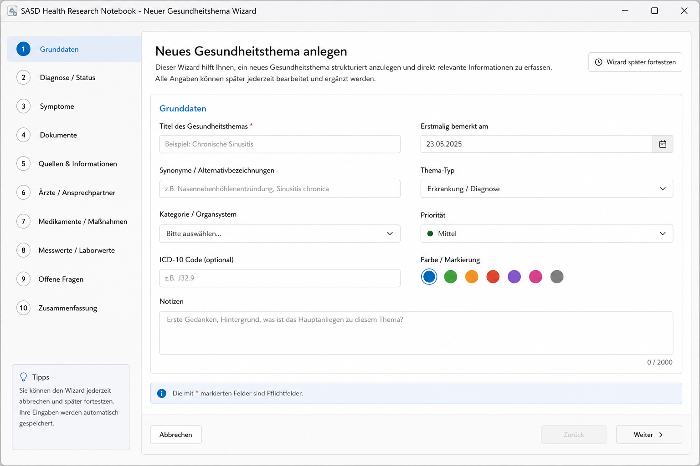

# SASD Health Research Notebook

> Local-first desktop application for documenting personal health topics, symptoms, documents, sources, measurements, lab values and questions for medical appointments.


## Project status

This repository is currently in the **concept and planning phase**.

The screenshot above is a **UI concept preview**, not a finished application. The goal of this repository is to develop the project step by step with clear documentation, a careful architecture and a strong focus on privacy, maintainability and data safety.

## Purpose

**SASD Health Research Notebook** is intended to help users collect, structure and retrieve personal health-related information in one local system.

The application is meant for:

- documenting health topics, conditions, suspected conditions and long-term observations
- collecting symptoms, notes, documents, sources and measurements
- preparing questions and summaries for doctor appointments
- keeping track of documents such as medical letters, lab reports, screenshots and research notes
- building a personal, searchable health knowledge base

## Important medical disclaimer

This project is **not** intended to diagnose, treat, prevent or cure diseases.

The software is planned as a personal documentation and research notebook. It must not replace professional medical advice, diagnosis or treatment. Medical decisions must remain with qualified healthcare professionals.

## Core idea

The project combines ideas from:

- electronic lab notebooks
- personal health records
- symptom trackers
- document management systems
- source and knowledge management tools
- local-first privacy-oriented desktop software

The application should work like a structured research notebook for personal health documentation, while avoiding unsafe medical recommendation or diagnosis functionality.

## Planned core features

### Health topics and conditions

- create health topics, conditions, suspected conditions and observation topics
- classify topics by status, priority, category and body system
- store synonyms and alternative names
- connect documents, symptoms, notes, questions, sources and appointments to a topic

### Condition wizard

The application should include a guided wizard for creating a new health topic.



Planned wizard steps:

1. Basic data
2. Diagnosis / status
3. Symptoms
4. Documents
5. Sources and information
6. Doctors and contacts
7. Medication and measures
8. Measurements and lab values
9. Open questions
10. Summary and save

The wizard should support saving drafts and continuing later.

### Documents and sources

- attach PDF files, images, screenshots, scans and office documents
- store metadata such as title, date, document type and related health topic
- manage sources such as websites, books, studies, doctor statements and own observations
- distinguish between verified medical documents and unverified research notes

### Symptoms and timeline

- record symptoms with date, intensity, duration and notes
- display a chronological timeline
- connect symptoms to health topics, documents, measurements and appointments

### Measurements and lab values

- document measurements such as blood pressure, pulse, weight or other manually entered values
- document lab values with unit, reference range and date
- mark values outside known reference ranges without providing medical interpretation

### Questions and appointments

- collect open questions for doctors and specialists
- connect questions to health topics and documents
- prepare appointment summaries and printable question lists

### Search and tagging

- full-text search across topics, notes, documents, sources and questions
- tags and synonyms
- filters by date, topic, document type, priority and status

### Export

- export selected information as Markdown
- create appointment preparation summaries
- create doctor-friendly reports
- later: PDF export and selected data packages

### Backup and restore

- local backups
- restore validation
- clear backup location and backup history
- later: encrypted backup archives

## Privacy and security principles

The project should follow these principles from the beginning:

- local-first by default
- no mandatory cloud connection
- no telemetry
- no silent upload of health data
- careful logging without sensitive medical contents
- clear export control
- backup and restore before destructive operations
- later: encrypted storage and master-password protection

## Planned technical direction

The initial preferred technical direction is:

- **Language:** C#
- **Runtime:** .NET 8 or newer
- **UI:** WPF or WinForms after final architecture decision
- **Database:** SQLite
- **Search:** SQLite FTS5 or later Lucene.NET
- **Documents:** local file storage with metadata in the database
- **Architecture:** layered architecture with UI, Application, Domain and Infrastructure
- **Testing:** xUnit-based unit tests and integration tests

The final architecture will be documented in separate architecture and database design documents.

## Suggested repository structure

```text
SASD-Health-Research-Notebook/
├── README.md
├── LICENSE
├── .gitignore
├── docs/
│   ├── screenshots/
│   │   ├── dashboard-concept.png
│   │   └── condition-wizard-concept.png
│   ├── requirements/
│   │   └── README.md
│   ├── architecture/
│   │   └── README.md
│   └── database/
│       └── README.md
└── repository_description.txt
