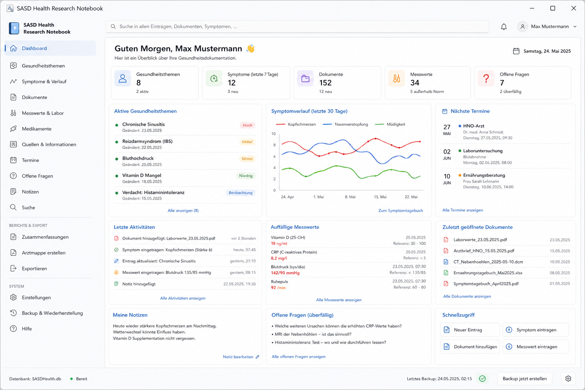

# SASD Health Research Notebook

> Local-first Windows desktop application for documenting personal health topics, observations, sources, measurements, sessions, documents and user-defined routines — designed for personal organization and research, not diagnosis or therapy.



## Project status

The repository is in the **early implementation phase**.

A working .NET desktop application baseline already exists with:

- layered Domain / Application / Infrastructure projects;
- a local JSON-backed HealthTopic repository;
- a WinForms timeline for notes, observations and research entries, stored separately in `health-entries.json`;
- a WinForms source workspace with exact locations and source notes, separating original excerpts from personal summaries in a versioned `sources.json` store (Slice 1; manually accepted);
- a WinForms measurement workspace for blood pressure (separate systolic/diastolic values and optional pulse), pulse, body temperature, blood glucose and weight, with explicit fixed units in a separate `measurements.json` store (Slice 1; manually accepted);
- a WinForms session workspace for appointments, ordered questions with separate answer notes and user-entered follow-ups with optional due dates in `sessions.json` (Slice 1; manually accepted);
- a WinForms action/routine workspace with user-reported provenance, paused/active routines and historical execution notes in `health-actions.json` (Slice 1; manually accepted);
- documentative action/routine/today counts on the dashboard;
- a functional WPF application shell;
- a first WinForms frontend baseline using the same application services and JSON persistence;
- a first "new health topic" wizard;
- smoke tests;
- concept screenshots that define the intended visual direction.

The current implementation is not yet feature-complete. The immediate development goal is to keep the application small, runnable and close to the concept screenshots while preserving working behavior and data safety.

## Purpose

SASD Health Research Notebook is a personal, local-first health documentation and research workspace.

It is intended to help users:

- organize health topics, conditions, suspicions and long-term observations;
- document symptoms, measurements, nutrition/context and personal observations;
- collect PDFs, images, screenshots and other supporting material;
- keep research sources with exact citation locations and trust metadata;
- prepare and follow up doctor, therapy, coaching or consultation sessions;
- manage user-defined actions, routines, progress and reminders;
- collect questions and unresolved points;
- build a searchable timeline and export selected information.

## Important medical boundary

This application is **not** intended to diagnose, treat, prevent or cure disease.

It must not:

- create diagnoses;
- generate treatment recommendations;
- decide medication doses;
- tell users to start, stop or change medication;
- derive health actions automatically from a disease or measurement;
- claim that weather, nutrition or another context factor caused a symptom;
- treat a source rating as medical validation.

The application may document what the user entered, what a professional reportedly said, what a source states, and what remains open for clarification.

## UI target

The visual target is documented by the repository screenshots:

- [Dashboard concept](docs/screenshots/dashboard-concept.png)
- [Condition wizard concept](docs/screenshots/condition-wizard-concept.png)

The implementation plan is described in:

- [UI target and screenshot plan](docs/ui-ux/055_UI_Zielbild_und_Screenshot_Plan.md)
- [Codex implementation guide](docs/development/145_Codex_Arbeitsauftrag.md)

## Documentation Baseline 2.1

The September 2026 revision consolidates the requirements developed since the initial planning baseline.

Start here:

- [Documentation map](docs/000_Dokumentationsuebersicht.md)
- [Documentation revision 2.1](docs/changes/160_Dokumentationsrevision_2_1.md)
- [Health modules requirements baseline 2.1](docs/requirements/155_Fachmodule_Baseline_2_1.md)
- [Architecture](docs/architecture/030_Architekturkonzept.md)
- [Database model](docs/database/040_Datenmodell_Datenbankdesign.md)
- [UI/UX concept](docs/ui-ux/050_UI_UX_Konzept.md)
- [Milestone plan](docs/roadmap/115_Milestone_und_Release_Plan.md)
- [ADRs](docs/adr/130_Architekturentscheidungen_ADR.md)

## Planned health modules

The target model includes, implemented incrementally:

- health topics;
- observations and symptom/context diary;
- measurements and lab values;
- nutrition diary;
- optional immutable weather snapshots linked to measurements/observations;
- doctor visits, coaching and other sessions with preparation/follow-up;
- questions and open points;
- sourced HealthActions;
- user-defined routines and progress counters;
- local notifications/reminders;
- documents, images and media resources;
- research sources, exact source locations and evidence notes;
- contact references prepared for later integration with a shared SASD contacts application.

These are a roadmap, not a promise that every module is already implemented.

## Privacy and security principles

- local-first by default;
- no mandatory cloud connection;
- no telemetry;
- no silent upload of health data;
- no health contents in technical logs;
- explicit export control;
- archive/restore instead of silent deletion;
- backups and migration safety;
- later encrypted storage after explicit architecture decision;
- discreet notification mode for health-related reminders.

## Technical baseline

- **Language:** C#
- **Runtime:** .NET 8+
- **Desktop UI:** WinForms primary frontend; WPF buildable reference frontend
- **Current persistence:** local JSON
- **Planned persistence:** SQLite with migrations
- **Search:** SQLite FTS5 planned
- **Documents/media:** managed local file store with metadata
- **Architecture:** Domain / Application / Infrastructure / WPF / WinForms
- **Testing:** current smoke-test runner, later broader unit/integration tests

## Build and run

```powershell
dotnet restore
dotnet build Sasd.HealthNotebook.sln --configuration Release
dotnet run --project tests/Sasd.HealthNotebook.SmokeTests --configuration Release
dotnet run --project src/Sasd.HealthNotebook.Wpf
dotnet run --project src/Sasd.HealthNotebook.WinForms
```

A GitHub Actions workflow validates restore, build and smoke tests on Windows.

## Safe development and test data

Use the repository-local launcher for development (synthetic data only):

Details and verification: [Safe development data](docs/development/146_Sichere_Entwicklungsdaten.md).

```powershell
./scripts/Invoke-SafeDevelopment.ps1                     # restore, Release build, smoke tests
./scripts/Invoke-SafeDevelopment.ps1 -Action WinForms    # run previously built WinForms
./scripts/Invoke-SafeDevelopment.ps1 -Action Wpf         # run previously built WPF
```

Run the launcher from the repository working directory. It sets
`SASD_HEALTHNOTEBOOK_DATA_PATH` to `.codex/synthetic-development-data`
and redirects .NET/NuGet caches and temporary files into `.codex/`, which Git ignores.
Environment changes apply only to the process and are restored afterwards. No cleanup occurs.

For an existing developer shell, an explicit override is also supported:

```powershell
$env:SASD_HEALTHNOTEBOOK_DATA_PATH = Join-Path (Get-Location).Path '.codex/synthetic-development-data'
```

The override specifies the **data directory**; `health-topics.json`, `health-entries.json`, `sources.json`, `measurements.json`, `sessions.json`, `health-actions.json` and their backups
are stored directly there. It must be a fully qualified ordinary drive or UNC path;
Windows device/extended-length namespaces are rejected. Invalid configured values
fail instead of falling back to personal data. Both frontends use the shared
Infrastructure resolver. A repository-local path must be verified before agent runs;
the general product override is not a filesystem sandbox.

Without the variable, the product path remains
`LocalApplicationData/SASD-GmbH/HealthResearchNotebook/data`. Nothing is migrated.
Smoke tests never access that path: they only assert its resolved value, then use
a fresh GUID subdirectory under the configured repository-local root, or under
`.codex/smoke-tests` when no override is set. Run them from within the repository.
They reject outside paths and junction/symlink ancestors, restore the incoming
environment value, and retain synthetic artifacts for inspection.

## Frontend status

- **WinForms** is the current primary development frontend. It provides the functional baseline: dashboard, navigation, topic list, refresh, status line, health-topic wizard and German/English localization.
- **WPF** remains buildable as a reference frontend and compatibility check for the shared Application/Infrastructure layers.
- Both frontends use the same `HealthTopicService`, `JsonHealthTopicRepository` and local JSON file, so they do not create separate data worlds.
- The WinForms baseline contains a small localization foundation for German and English. It starts in German on German Windows installations, otherwise in English, and offers a language selector in the main window.
- [WinForms UI Baseline 2](docs/development/147_WinForms_UI_Baseline_2.md) documents the shell, navigation, grid and wizard polish, automated control checks and remaining manual desktop checks. The safe launcher runs both shared and WinForms smoke tests.

Action/routine scope, verification and manual checklist: [HealthAction + Routine + Progress Slice 1](docs/development/152_HealthAction_Routine_Progress_Slice_1.md).

## Codex

Repository-level instructions for Codex are in [AGENTS.md](AGENTS.md).

The preferred near-term sequence is:

1. polish the existing WinForms application shell;
2. bring the WinForms dashboard closer to the concept screenshot;
3. refine the WinForms wizard;
4. stabilize the WinForms navigation host;
5. keep WPF buildable as a reference;
6. then implement new health features as small vertical slices in WinForms first.

## License

See [LICENSE](LICENSE).


## Edit / Archive / Delete Baseline

The WinForms lifecycle baseline adds correction dialogs for measurements, timeline
entries, sessions, actions, routines and execution entries. Sessions/actions have a
separate archive filter. Health topics also support correction and archive/reactivate;
topic deletion requires no current or historical references. Individual measurements,
timeline entries, execution entries and follow-ups require explicit deletion confirmation;
questions can only be deleted when unanswered and without an answer note. Professional/source-backed action
corrections retain local revisions. See [Slice 153](docs/development/153_Edit_Archive_Delete_Baseline_Slice_1.md)
for JSON v1/v2 compatibility and the recorded manual acceptance scope. Topic and
session-child lifecycle functions, blood pressure entry and the measurement-type filter
are manually accepted; older lifecycle checks and action revision history remain
manually unconfirmed. PR #18 is authorized for Ready for Review after final validation;
no merge is authorized.
