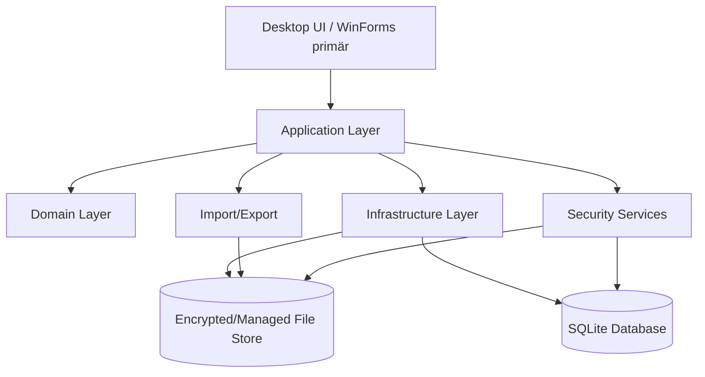
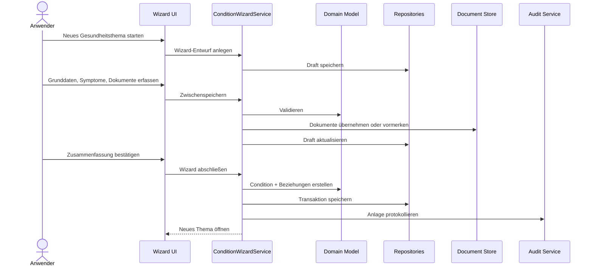

# 030 - Architekturkonzept

Projekt: SASD Health Research Notebook  
Stand: 2026-05-25  
Dokumenttyp: Architekturkonzept  
Status: Baseline 2.1a  

> **Aktuelle Frontendregel (2026-09-30):** WinForms ist gemäß ADR-0020 das primäre Produkt- und Entwicklungsfrontend. WPF bleibt buildbare Referenz und Kompatibilitätscheck. Ältere WPF-Präferenzen in diesem Dokument sind historischer Planungsstand und werden durch ADR-0020 ersetzt.

## 1. Ziel des Architekturkonzepts

Dieses Dokument beschreibt die technische Zielarchitektur für das SASD Health Research Notebook. Es soll verhindern, dass das Projekt als einfache Notiz-App beginnt und später wegen Datenschutz, Dokumentenablage, Suche, Backup, Wizard, Exporten oder medizinischer Abgrenzung vollständig umgebaut werden muss.

Die Architektur soll klein genug für einen realistischen Start sein, aber stabil genug für spätere Erweiterungen wie OCR, KI-Unterstützung, FHIR-Export, mobile Begleit-App oder verschlüsselte Synchronisation.

## 2. Architekturziele

| Ziel | Beschreibung |
|---|---|
| Lokal-first | Die Anwendung soll vollständig lokal nutzbar sein. Keine Cloud-Pflicht. |
| Datenschutzorientiert | Gesundheitsdaten werden als besonders sensibel behandelt. |
| Modular | Fachlogik, UI, Datenhaltung, Dokumentenablage und Exporte werden getrennt. |
| Erweiterbar | Spätere Module wie OCR, KI oder FHIR dürfen ergänzt werden können. |
| Verständlich | Die Architektur soll für SASD-Projekte nachvollziehbar und dokumentierbar bleiben. |
| Testbar | Fachlogik soll ohne UI testbar sein. |
| Robust | Keine stillen Datenverluste, keine unkontrollierte Dateibehandlung. |
| Nicht-diagnostisch | Keine automatische Diagnose- oder Therapieentscheidung. |

## 3. Nicht-Ziele der ersten Version

Nicht Ziel von V1 sind:

- Cloud-Synchronisation
- mobile App
- Mehrbenutzerbetrieb
- Arztsystem-Integration
- automatische Diagnose
- Therapieempfehlungen
- automatische Medikamentenbewertung
- KI-Auswertung sensibler Daten
- FHIR-Produktivschnittstelle
- Mandantenfähigkeit
- Webserver-Betrieb

Diese Punkte sollen nicht grundsätzlich ausgeschlossen werden, aber sie dürfen die erste Architektur nicht unnötig verkomplizieren.

## 4. Technologieempfehlung

| Bereich | Empfehlung | Begründung |
|---|---|---|
| Sprache | C# | Passt zu bestehenden SASD-Desktopprojekten. |
| Runtime | .NET 8 LTS oder neuer | Stabil, gut unterstützt, geeignet für Desktop und Tests. |
| UI | WinForms primär; WPF als Referenz | WinForms ist das aktuelle Produktfrontend. WPF bleibt buildbar, ohne neue Features parallel nachzubauen. |
| Datenbank | SQLite | Lokal, robust, gut testbar, kein Server nötig. |
| Suche | SQLite FTS5 | Volltextsuche ohne separate Suchmaschine möglich. |
| Verschlüsselung | SQLCipher oder appseitige Vault-Verschlüsselung | Für Gesundheitsdaten langfristig wichtig. |
| Tests | xUnit | Konsistent mit anderen SASD-.NET-Projekten. |
| Export | Markdown zuerst, PDF später | Markdown ist transparent, diffbar und leicht testbar. |
| Diagramme | Mermaid in Markdown | GitHub-kompatibel und wartbar. |

## 5. Architekturstil

Empfohlen wird ein **modularer Monolith** mit klarer Schichtentrennung.

Ein modularer Monolith ist für V1 sinnvoller als Microservices oder Plugin-Architektur. Die Anwendung bleibt einfach installierbar, lokal betreibbar und testbar. Gleichzeitig werden fachliche Module so getrennt, dass spätere Auslagerungen möglich bleiben.

## 6. Schichtenmodell



## 7. Projekte in der Solution

Empfohlene Solution-Struktur:

```text
Sasd.HealthResearchNotebook.sln

src/
  Sasd.HealthNotebook.WinForms/                 # primäres Produktfrontend
  Sasd.HealthNotebook.Wpf/                      # buildbare Referenzoberfläche
  Sasd.HealthResearchNotebook.Domain/           # Entitäten, Value Objects, fachliche Regeln
  Sasd.HealthResearchNotebook.Application/      # Use Cases, Services, DTOs
  Sasd.HealthResearchNotebook.Infrastructure/   # SQLite, Dateien, Repositories, Migrationen
  Sasd.HealthResearchNotebook.ImportExport/     # Markdown/PDF/Backup/Import
  Sasd.HealthResearchNotebook.Security/         # Verschlüsselung, Datenschutzfunktionen

tests/
  Sasd.HealthResearchNotebook.Domain.Tests/
  Sasd.HealthResearchNotebook.Application.Tests/
  Sasd.HealthResearchNotebook.Infrastructure.Tests/
  Sasd.HealthResearchNotebook.ImportExport.Tests/
```

## 8. Domänenmodule

| Modul | Zweck |
|---|---|
| Conditions | Gesundheitsthemen/Krankheiten/Verdachtsfälle verwalten |
| Entries | Notizen, Beobachtungen, Quellenhinweise, Arztfragen |
| Symptoms | Symptome, Schweregrade, Verlaufserfassung |
| Documents | Dokumente, Anhänge, Dateien, Hashes, Metadaten |
| Sources | Webseiten, Studien, Bücher, Ärzte, Gespräche, Herkunft von Informationen |
| Measurements | Messwerte, Laborwerte, Referenzbereiche |
| Appointments | Arzttermine, Vorbereitung, Gesprächsnotizen |
| Questions | Offene Fragen, Klärungsbedarf, Status |
| Tags | Tags, Synonyme, Kategorien, Organsysteme |
| Timeline | Chronologische Ansicht aller relevanten Ereignisse |
| Search | Volltextsuche, Filter, gespeicherte Suchanfragen |
| Export | Arztmappe, Markdown-Export, Backup |
| Audit | Änderungsprotokoll wichtiger Aktionen |
| Settings | Konfiguration, Speicherorte, Sicherheitsoptionen |

## 9. Kernfluss: Wizard zum Anlegen eines Gesundheitsthemas



## 10. Speicherarchitektur

Die Anwendung soll zwei Speicherbereiche unterscheiden:

1. **Metadatenbank**  
   SQLite-Datenbank mit Entitäten, Beziehungen, Metadaten, Tags, Status, Timeline, Suchindex.

2. **Dokumentenablage**  
   Verwalteter Dateiordner für PDFs, Bilder, Scans, DICOM-Dateien, Tabellen und Exportdateien.

Dokumente werden nicht zwingend als BLOB in der Datenbank gespeichert. Stattdessen speichert die Datenbank:

- relativen Pfad
- Originaldateiname
- Dateityp
- Dateigröße
- Hash
- Importdatum
- Zuordnungen
- Beschreibung
- Sichtbarkeits-/Exportstatus

## 11. Transaktionsprinzip

Bei Vorgängen mit Datenbank und Dateien muss ein sicherer Ablauf definiert werden.

Beispiel Dokumentimport:

1. Datei in temporären Importbereich kopieren.
2. Hash berechnen.
3. Dubletten prüfen.
4. Metadaten validieren.
5. Datei in endgültigen Dokumentenspeicher verschieben.
6. Datenbankeintrag in Transaktion speichern.
7. Audit-Eintrag schreiben.
8. Bei Fehler temporäre Datei entfernen oder als Recovery-Fall markieren.

## 12. Fehlerbehandlung

Fehler sollen nicht nur als technische Meldung erscheinen. Jede Fehlermeldung braucht:

- technische Fehler-ID
- verständliche Anwenderbeschreibung
- empfohlene Aktion
- optionalen Detailbereich
- Protokollierung ohne sensible Inhalte

Beispiel:

```text
Dokument konnte nicht importiert werden.
Die Datei ist möglicherweise beschädigt oder nicht lesbar.
Bitte prüfen Sie die Datei oder versuchen Sie eine Kopie zu importieren.
Fehler-ID: DOC-IMPORT-0042
```

## 13. Logging

Logging darf keine Gesundheitsdetails enthalten. Keine Diagnosen, Symptome, Dateinamen mit medizinischem Inhalt, Laborwerte oder Freitexte in Logs.

Erlaubt:

- Start/Stop der Anwendung
- technische Fehlercodes
- Dauer von Operationen
- Anzahl importierter Dateien
- Migration erfolgreich/fehlgeschlagen
- Backup erfolgreich/fehlgeschlagen

Nicht erlaubt:

- Titel von Gesundheitsthemen
- Arztbrief-Dateinamen, wenn sie Diagnosen enthalten
- Notizinhalte
- Laborwerte
- Medikamentennamen
- Volltextsuchbegriffe

## 14. Konfiguration

Empfohlene Speicherorte unter Windows:

```text
%LocalAppData%\SASD-GmbH\HealthResearchNotebook  appsettings.json
  logs  data    health-notebook.db
    documents    exports    backups```

Falls Verschlüsselung aktiv ist, müssen Datenbank und Dokumente gemeinsam geschützt werden.

## 15. Sicherheitsarchitektur

Die Architektur muss optional oder perspektivisch folgende Funktionen unterstützen:

- Master-Passwort
- Datenbankverschlüsselung
- Dokumentenverschlüsselung
- Backup-Verschlüsselung
- automatische Sperre nach Inaktivität
- Export-Warnungen
- datenschutzfreundliches Logging
- Wiederherstellungstests
- sichere Löschstrategie für temporäre Dateien

## 16. KI-Architektur als spätere Erweiterung

KI-Funktionen werden nicht in V1 aufgenommen. Die Architektur soll aber später erlauben:

- lokale Zusammenfassungen von Einträgen
- Extraktion von Dokumentmetadaten
- Vorschläge für Tags
- Vorschläge für Arztfragen
- Widerspruchshinweise zwischen Quellen

Wichtig: KI darf nicht ungefragt Gesundheitsdaten an externe Dienste senden. Jeder KI-Vorgang muss explizit, protokolliert und konfigurierbar sein.

## 17. Medizinprodukt-Abgrenzung

Die Anwendung darf in V1 keine medizinischen Entscheidungen treffen. Kritische UI-Texte:

- „Dieses Programm dient der persönlichen Dokumentation und Vorbereitung.“
- „Es ersetzt keine ärztliche Beratung.“
- „Bewertungen und Entscheidungen müssen mit medizinischem Fachpersonal besprochen werden.“
- „Automatische Diagnosen oder Therapieempfehlungen werden nicht erstellt.“

Die Architektur soll diese Grenze technisch unterstützen:

- keine Diagnose-Engine
- keine Therapieempfehlungsregeln
- keine automatische Risikoeinstufung mit Handlungsanweisung
- keine Medikamenteninteraktionsprüfung in V1
- keine Warnung wie „sofort Medikament absetzen“

## 18. Erweiterungspunkte

| Erweiterung | Vorbereitung in V1 |
|---|---|
| OCR | Dokumentenmodell mit OCR-Status und extrahiertem Text vorbereiten |
| FHIR | Messwerte und Metadaten sauber strukturieren |
| KI | Serviceschnittstelle entwerfen, aber nicht aktivieren |
| Mobile App | Datenmodell unabhängig von Desktop-UI halten |
| Cloud Sync | lokale IDs, Änderungszeitstempel, Konfliktfelder vorbereiten |
| Mehrbenutzer | CreatedBy/ModifiedBy optional vorsehen, aber nicht verwenden |
| Verschlüsselung | Speicherzugriff über Interfaces kapseln |

## 19. Qualitätsanforderungen

| Bereich | Anforderung |
|---|---|
| Startzeit | Anwendung soll auch mit vielen Dokumenten zügig starten. |
| Suche | Suche soll auch bei mehreren tausend Einträgen nutzbar bleiben. |
| Import | Dokumentimport darf UI nicht dauerhaft blockieren. |
| Backup | Backup muss überprüfbar sein. |
| Restore | Wiederherstellung muss getestet werden. |
| Migration | Datenbankschemaänderungen müssen versioniert werden. |
| UI | Datenverlust durch versehentliches Schließen muss verhindert werden. |

## 20. Architekturentscheidungen, die in ADRs festzuhalten sind

- Lokal-first statt Cloud-first
- Desktop-first statt Web-first
- SQLite statt Serverdatenbank
- WPF statt WinForms oder Web UI
- Dokumente im Dateisystem statt BLOBs
- Markdown-Export zuerst, PDF später
- Keine KI in V1
- Keine Diagnose-/Therapie-Funktion
- Audit/Archiv statt stilles Löschen
- SQLCipher oder alternative Verschlüsselung als Sicherheitsausbau

## 21. Quellen und Standards als Orientierung

- DSGVO Art. 9: besondere Kategorien personenbezogener Daten, darunter Gesundheitsdaten: https://gdpr-info.eu/art-9-gdpr/
- Europäische Kommission, MDR/IVDR Guidance und MDCG-Dokumente: https://health.ec.europa.eu/medical-devices-sector/new-regulations/guidance-mdcg-endorsed-documents-and-other-guidance_en
- HL7 FHIR Overview: https://www.hl7.org/fhir/overview.html
- SQLite FTS5: https://sqlite.org/fts5.html
- OWASP ASVS: https://owasp.org/www-project-application-security-verification-standard/
- SQLCipher: https://www.zetetic.net/sqlcipher/


---

## 22. Architekturergänzung Baseline 2.1 (2026-09-30)

### 22.1 Entwicklung in vertikalen Slices

Nach der UI-Baseline werden neue Fachbereiche bevorzugt als vertikale Slices umgesetzt. Ein Slice umfasst Domain, Application, Persistenz, UI und Tests für einen klaren Anwendungsfall.

Dies verhindert zwei Extreme:

- eine große Datenbank voller ungenutzter Tabellen;
- UI-Prototypen ohne belastbare Fachlogik.

### 22.2 Neue fachliche Grenzen

Die folgenden Konzepte werden getrennt gehalten:

- Observation: dokumentiert Wahrnehmung/Messung;
- Session: dokumentiert Termin/Gespräch/Beratung;
- HealthAction: dokumentiert eine konkrete Handlung und deren Herkunft;
- Routine: wiederkehrende, vom Nutzer konfigurierte Durchführung;
- Reminder: technische Erinnerung an eine konfigurierte Aufgabe;
- Source/EvidenceNote: dokumentiert Herkunft und genaue Belegstelle;
- ContextSnapshot: unveränderlicher Kontext zu einem Ereignis;
- ContactReference: schlanke Referenz statt CRM.

### 22.3 Adapter für externe Kontextdienste

Wetter und ähnliche optionale Kontextdienste werden über Application-Abstraktionen und Infrastructure-Adapter angebunden.

Regeln:

- Kernfunktion bleibt offline nutzbar.
- Externer Fehler blockiert keine lokale Speicherung.
- Datenquelle und Abrufzeitpunkt werden nachvollziehbar.
- Kein externer Dienst erhält automatisch den vollständigen Gesundheitskontext.

### 22.4 Kontaktintegration

Ein späteres SASD-Contacts-System wird über einen Adapter bzw. eine externe ID angebunden. Die Health-Domain darf nicht von einer konkreten Contacts-Anwendung abhängig werden.

### 22.5 UI-Architektur

Historischer Planungsstand: Der Navigation Host war zunächst für WPF vorgesehen. Seit ADR-0020 wird der Navigation Host im primären WinForms-Frontend weiterentwickelt; WPF bleibt Referenz und Kompatibilitätscheck.


---

## 23. Frontendstrategie 2.1a - WinForms primär, WPF Referenz (2026-09-30)

### 23.1 Entscheidung

Für die nächste Entwicklungsphase ist `Sasd.HealthNotebook.WinForms` das primäre Produktfrontend.

`Sasd.HealthNotebook.Wpf` bleibt im Repository und muss buildbar bleiben. Es dient als:

- Referenz für den bisherigen UI-Stand;
- Kompatibilitätscheck für UI-unabhängige Application-/Infrastructure-Verträge;
- mögliche spätere alternative Oberfläche.

### 23.2 Keine doppelte Fachentwicklung

Neue Fachmodule werden nicht gleichzeitig separat in WPF und WinForms implementiert.

Regel:

```text
Domain / Application / Infrastructure
                 ↑
        WinForms primär
                 +
          WPF Referenz
```

Wenn eine neue Funktion gemeinsame Fachlogik benötigt, wird diese in den gemeinsamen Schichten implementiert. Die aktuelle Produkt-UI wird anschließend in WinForms gebaut.

### 23.3 Gemeinsame Persistenz

Solange JSON die aktive Persistenz ist, verwenden beide Frontends denselben Repository-Vertrag und denselben lokalen Datenpfad.

Frontend-spezifische HealthTopic-Modelle, Repositories oder Datenbestände sind nicht zulässig.

### 23.4 Presentation Architecture

WinForms soll Forms nicht zu Fachlogik-Sammelstellen machen.

Bevorzugte Verantwortungen:

- Form: Shell, Ereignisse, Dialog-Lifecycle;
- View/UserControl: Darstellung eines Arbeitsbereichs;
- Presenter/Controller: Präsentationsablauf und Mapping;
- Application Service: Use Cases;
- Domain: fachliche Regeln;
- Infrastructure: Persistenz/Dateien/externe Adapter.

Die bestehende leichte Presenter-Struktur wird weiterentwickelt, ohne ein zusätzliches UI-Framework zu erzwingen.

### 23.5 Konsequenz für die alte WPF-Planung

Abschnitt 22.5 und ältere Formulierungen, die WPF als aktiven nächsten Navigation Host beschreiben, gelten nur noch historisch. Der Navigation Host und neue Produktseiten werden aktuell primär im WinForms-Frontend entwickelt.
