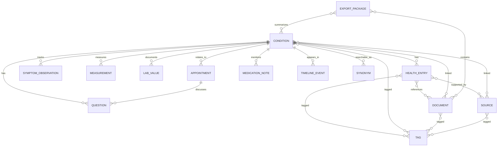

# 040 - Datenmodell und Datenbankdesign

Projekt: SASD Health Research Notebook  
Stand: 2026-05-25  
Dokumenttyp: Datenmodell / Datenbankdesign  
Status: Entwurf  

## 1. Ziel des Datenmodells

Das Datenmodell soll persönliche Gesundheitsinformationen, Dokumente, Quellen, Symptome, Messwerte, Fragen und Verlaufseinträge so speichern, dass sie langfristig nachvollziehbar, durchsuchbar, exportierbar und sicher verwaltbar sind.

Das Modell muss mit einem kleinen MVP starten können, aber spätere Erweiterungen wie OCR, FHIR-Export, KI-gestützte Zusammenfassungen, Versionshistorie und verschlüsselte Speicherung berücksichtigen.

## 2. Grundprinzipien

1. **Gesundheitsthema als Zentrum**  
   Viele Informationen werden um ein Gesundheitsthema herum gesammelt.

2. **Nicht jede Information ist eine Diagnose**  
   Ein Thema kann Diagnose, Verdacht, Symptomkomplex, Risikofaktor oder Recherchethema sein.

3. **Dokumente sind eigene Objekte**  
   Ein Dokument kann mehreren Themen zugeordnet sein.

4. **Quellen sind eigene Objekte**  
   Eine Quelle kann mehrere Einträge stützen.

5. **Zeitachse ist abgeleitet und teilweise explizit**  
   Ereignisse können aus Einträgen, Symptomen, Messwerten und Terminen entstehen.

6. **Archivieren vor Löschen**  
   Medizinisch relevante Daten sollen nicht versehentlich verschwinden.

7. **Änderungen nachvollziehbar machen**  
   Kritische Änderungen erzeugen Audit-Einträge.

8. **Datenschutzfreundliche Technik**  
   Keine sensiblen Daten in Logs, temporären Dateien oder ungeschützten Exporten.

## 3. Zentrale Entitäten

| Entität | Beschreibung |
|---|---|
| Condition | Gesundheitsthema/Krankheit/Verdacht |
| HealthEntry | allgemeiner Eintrag, Notiz, Beobachtung, Recherchehinweis |
| Symptom | Symptom-Stammdaten |
| SymptomObservation | konkrete Symptom-Beobachtung zu einem Zeitpunkt |
| Document | importiertes Dokument oder Datei |
| Source | Quelle einer Information |
| Measurement | Messwert oder einfacher Verlaufswert |
| LabValue | spezieller Laborwert mit Referenzbereich |
| MedicationNote | Medikamentenbezogene Dokumentation ohne Therapieempfehlung |
| Appointment | Arzttermin oder medizinischer Termin |
| Question | offene Frage für Arzt, Recherche oder Selbstklärung |
| Tag | frei vergebbares Schlagwort |
| Synonym | alternative Begriffe und Suchbegriffe |
| TimelineEvent | expliziter oder abgeleiteter Verlaufseintrag |
| ExportPackage | gespeicherter Exportvorgang/Arztmappe |
| AuditLogEntry | Änderungs-/Sicherheitsprotokoll |
| BackupRecord | dokumentierte Sicherung |
| WizardDraft | Zwischenspeicher für angefangene Wizards |

## 4. ER-Überblick



## 5. Tabellenentwurf

### 5.1 `conditions`

Zentrale Tabelle für Gesundheitsthemen.

| Feld | Typ | Beschreibung |
|---|---|---|
| id | TEXT/UUID | Primärschlüssel |
| title | TEXT | Titel, z. B. „Chronische Sinusitis“ |
| normalized_title | TEXT | normalisierte Form für Suche/Dublettenprüfung |
| condition_type | TEXT | diagnosis, suspicion, symptom_cluster, risk_factor, research_topic |
| diagnosis_status | TEXT | confirmed, suspected, ruled_out, monitoring, unknown |
| priority | TEXT | low, medium, high, urgent_review |
| first_noticed_on | TEXT/DATE | erstmalig bemerkt |
| diagnosed_on | TEXT/DATE | Diagnosezeitpunkt, falls vorhanden |
| icd10_code | TEXT | optionaler ICD-10-Code, keine Pflicht |
| organ_system | TEXT | Kategorie/Organsystem |
| color_marker | TEXT | UI-Farbmarkierung |
| summary | TEXT | kurze Zusammenfassung |
| notes | TEXT | Freitextnotizen |
| is_archived | INTEGER | Archivstatus |
| archived_at | TEXT/DATETIME | Archivzeitpunkt |
| created_at | TEXT/DATETIME | Erstellzeitpunkt |
| updated_at | TEXT/DATETIME | Änderungszeitpunkt |

### 5.2 `health_entries`

Allgemeine Einträge. Sehr wichtig, da viele Informationen nicht in starre Spezialtabellen passen.

| Feld | Typ | Beschreibung |
|---|---|---|
| id | TEXT/UUID | Primärschlüssel |
| condition_id | TEXT/UUID | optionale Zuordnung zu Condition |
| entry_type | TEXT | note, observation, research, doctor_note, decision, summary, warning, idea |
| title | TEXT | kurzer Titel |
| content | TEXT | Inhalt |
| occurred_on | TEXT/DATETIME | fachliches Datum des Ereignisses |
| source_confidence | TEXT | unknown, low, medium, high, professional |
| importance | TEXT | low, normal, important, critical |
| status | TEXT | open, in_review, discussed, resolved, archived |
| created_at | TEXT/DATETIME | Erstellzeitpunkt |
| updated_at | TEXT/DATETIME | Änderungszeitpunkt |

### 5.3 `symptoms`

Stammdaten für Symptome.

| Feld | Typ | Beschreibung |
|---|---|---|
| id | TEXT/UUID | Primärschlüssel |
| name | TEXT | Symptomname |
| description | TEXT | Beschreibung |
| default_scale_min | INTEGER | meist 0 |
| default_scale_max | INTEGER | meist 10 |
| created_at | TEXT/DATETIME | Erstellzeitpunkt |

### 5.4 `symptom_observations`

Konkrete Symptom-Beobachtung.

| Feld | Typ | Beschreibung |
|---|---|---|
| id | TEXT/UUID | Primärschlüssel |
| condition_id | TEXT/UUID | Bezug zum Gesundheitsthema |
| symptom_id | TEXT/UUID | Bezug zum Symptom |
| observed_at | TEXT/DATETIME | Zeitpunkt |
| severity | INTEGER | Schweregrad, z. B. 0-10 |
| duration_minutes | INTEGER | optionale Dauer |
| trigger_note | TEXT | möglicher Auslöser als Notiz |
| context_note | TEXT | Kontext, z. B. Ernährung, Stress, Wetter |
| medication_context | TEXT | Medikamentenbezug als Freitext |
| notes | TEXT | weitere Beobachtung |
| created_at | TEXT/DATETIME | Erstellzeitpunkt |

### 5.5 `documents`

Metadaten importierter Dateien.

| Feld | Typ | Beschreibung |
|---|---|---|
| id | TEXT/UUID | Primärschlüssel |
| original_filename | TEXT | ursprünglicher Dateiname |
| stored_filename | TEXT | interner Dateiname |
| relative_path | TEXT | relativer Pfad im Dokumentenspeicher |
| mime_type | TEXT | Dateityp |
| document_type | TEXT | lab_report, doctor_letter, image, scan, web_capture, study, invoice, other |
| title | TEXT | sprechender Titel |
| description | TEXT | Beschreibung |
| file_size_bytes | INTEGER | Dateigröße |
| sha256_hash | TEXT | Prüfsumme |
| document_date | TEXT/DATE | fachliches Datum des Dokuments |
| imported_at | TEXT/DATETIME | Importzeitpunkt |
| ocr_status | TEXT | not_required, pending, done, failed, deferred |
| ocr_text | TEXT | später: extrahierter Text oder Referenz |
| is_sensitive | INTEGER | besonders sensibel |
| is_archived | INTEGER | Archivstatus |

### 5.6 `sources`

Quellen von Informationen.

| Feld | Typ | Beschreibung |
|---|---|---|
| id | TEXT/UUID | Primärschlüssel |
| source_type | TEXT | doctor, website, study, book, conversation, own_observation, document, other |
| title | TEXT | Titel der Quelle |
| author_or_provider | TEXT | Autor, Praxis, Klinik, Webseite |
| url | TEXT | optional |
| accessed_on | TEXT/DATE | Abrufdatum |
| published_on | TEXT/DATE | Veröffentlichungsdatum |
| reliability_rating | TEXT | unknown, low, medium, high, professional, official |
| notes | TEXT | Quellenkommentar |
| created_at | TEXT/DATETIME | Erstellzeitpunkt |

### 5.7 `measurements`

Allgemeine Messwerte.

| Feld | Typ | Beschreibung |
|---|---|---|
| id | TEXT/UUID | Primärschlüssel |
| condition_id | TEXT/UUID | optionaler Bezug |
| measurement_type | TEXT | blood_pressure, weight, pulse, glucose, temperature, custom |
| measured_at | TEXT/DATETIME | Zeitpunkt |
| value_text | TEXT | flexible Darstellung, z. B. 135/85 |
| value_numeric | REAL | optionaler Zahlenwert |
| value_secondary_numeric | REAL | z. B. diastolischer Wert |
| unit | TEXT | Einheit |
| context_note | TEXT | Kontext |
| source_document_id | TEXT/UUID | optionaler Dokumentbezug |
| created_at | TEXT/DATETIME | Erstellzeitpunkt |

### 5.8 `lab_values`

Spezielle Laborwerte.

| Feld | Typ | Beschreibung |
|---|---|---|
| id | TEXT/UUID | Primärschlüssel |
| condition_id | TEXT/UUID | optionaler Bezug |
| lab_name | TEXT | z. B. CRP, HbA1c, Vitamin D |
| measured_on | TEXT/DATE | Datum |
| value_numeric | REAL | Wert |
| value_text | TEXT | falls nicht numerisch |
| unit | TEXT | Einheit |
| reference_min | REAL | optional |
| reference_max | REAL | optional |
| reference_text | TEXT | Referenzbereich als Text |
| interpretation_note | TEXT | eigene Notiz, keine automatische Diagnose |
| source_document_id | TEXT/UUID | Laborbericht |
| created_at | TEXT/DATETIME | Erstellzeitpunkt |

### 5.9 `medication_notes`

Medikamentendokumentation. In V1 kein Medikationsplan mit Entscheidungslogik.

| Feld | Typ | Beschreibung |
|---|---|---|
| id | TEXT/UUID | Primärschlüssel |
| condition_id | TEXT/UUID | optionaler Bezug |
| medication_name | TEXT | Name |
| dose_note | TEXT | Dosierung als Freitext |
| start_on | TEXT/DATE | Beginn |
| end_on | TEXT/DATE | Ende |
| prescribed_by | TEXT | Arzt/Praxis als Freitext |
| purpose_note | TEXT | Grund/Zweck als Notiz |
| observation_note | TEXT | Beobachtete Wirkung/Nebenwirkung |
| status | TEXT | active, paused, stopped, historical, unknown |
| created_at | TEXT/DATETIME | Erstellzeitpunkt |

### 5.10 `appointments`

Arzttermine und medizinische Termine.

| Feld | Typ | Beschreibung |
|---|---|---|
| id | TEXT/UUID | Primärschlüssel |
| title | TEXT | Terminbezeichnung |
| appointment_type | TEXT | doctor, lab, imaging, therapy, consultation, other |
| starts_at | TEXT/DATETIME | Beginn |
| ends_at | TEXT/DATETIME | Ende |
| location | TEXT | Ort |
| provider_name | TEXT | Arzt/Praxis/Klinik |
| preparation_notes | TEXT | Vorbereitung |
| result_notes | TEXT | Gesprächsnotizen/Ergebnisse |
| status | TEXT | planned, done, cancelled, postponed |
| created_at | TEXT/DATETIME | Erstellzeitpunkt |

### 5.11 `questions`

Offene Fragen.

| Feld | Typ | Beschreibung |
|---|---|---|
| id | TEXT/UUID | Primärschlüssel |
| condition_id | TEXT/UUID | optionaler Bezug |
| appointment_id | TEXT/UUID | optionaler Terminbezug |
| question_text | TEXT | Frage |
| context_note | TEXT | Hintergrund |
| target | TEXT | doctor, own_research, pharmacy, lab, insurance, other |
| priority | TEXT | low, normal, high |
| status | TEXT | open, planned, asked, answered, obsolete |
| answer_note | TEXT | Antwort/Ergebnis |
| created_at | TEXT/DATETIME | Erstellzeitpunkt |
| updated_at | TEXT/DATETIME | Änderungszeitpunkt |

### 5.12 `tags` und Zuordnungstabellen

Tags werden über Join-Tabellen zugeordnet.

| Tabelle | Zweck |
|---|---|
| tags | Tag-Stammdaten |
| condition_tags | Tags für Gesundheitsthemen |
| entry_tags | Tags für Einträge |
| document_tags | Tags für Dokumente |
| source_tags | Tags für Quellen |

### 5.13 `synonyms`

Synonyme können global oder themenbezogen sein.

| Feld | Typ | Beschreibung |
|---|---|---|
| id | TEXT/UUID | Primärschlüssel |
| condition_id | TEXT/UUID | optionaler Bezug |
| term | TEXT | Begriff |
| normalized_term | TEXT | normalisierte Form |
| language | TEXT | z. B. de, en, la |
| note | TEXT | Erklärung |

### 5.14 `timeline_events`

Chronologische Ereignisse. Teilweise explizit, teilweise aus anderen Objekten ableitbar.

| Feld | Typ | Beschreibung |
|---|---|---|
| id | TEXT/UUID | Primärschlüssel |
| condition_id | TEXT/UUID | optional |
| event_type | TEXT | condition_created, symptom, lab_value, document, appointment, note, decision |
| event_at | TEXT/DATETIME | Zeitpunkt |
| title | TEXT | Titel |
| description | TEXT | Beschreibung |
| related_entity_type | TEXT | z. B. Document |
| related_entity_id | TEXT/UUID | Zielobjekt |
| created_at | TEXT/DATETIME | Erstellzeitpunkt |

### 5.15 `audit_log_entries`

Audit-Log für wichtige Änderungen. Keine unnötigen Gesundheitsdetails speichern.

| Feld | Typ | Beschreibung |
|---|---|---|
| id | TEXT/UUID | Primärschlüssel |
| event_at | TEXT/DATETIME | Zeitpunkt |
| action | TEXT | create, update, archive, restore, delete, export, backup, import |
| entity_type | TEXT | betroffene Entität |
| entity_id | TEXT/UUID | ID |
| summary | TEXT | datenschutzfreundliche Beschreibung |
| technical_details | TEXT | optional, keine Gesundheitsfreitexte |

### 5.16 `wizard_drafts`

Zwischenspeicherung angefangener Wizards.

| Feld | Typ | Beschreibung |
|---|---|---|
| id | TEXT/UUID | Primärschlüssel |
| wizard_type | TEXT | condition_creation |
| current_step | INTEGER | aktueller Schritt |
| draft_json | TEXT | serialisierter Entwurf |
| created_at | TEXT/DATETIME | Start |
| updated_at | TEXT/DATETIME | letzte Änderung |
| expires_at | TEXT/DATETIME | optional |
| is_completed | INTEGER | abgeschlossen |

## 6. Beziehungen

| Beziehung | Umsetzung |
|---|---|
| Condition - Document | `condition_documents` |
| Condition - Source | `condition_sources` |
| HealthEntry - Document | `entry_documents` |
| HealthEntry - Source | `entry_sources` |
| Appointment - Condition | `appointment_conditions` |
| ExportPackage - Document | `export_package_documents` |
| ExportPackage - Condition | `export_package_conditions` |

## 7. Lösch- und Archivierungsmodell

| Aktion | Verhalten |
|---|---|
| Archivieren | Objekt bleibt erhalten, wird aber aus Standardansichten ausgeblendet. |
| Wiederherstellen | Archivstatus wird entfernt, Audit-Eintrag wird erzeugt. |
| Hart löschen | Nur für eindeutig falsch importierte oder leere Testdaten, mit Warnung. |
| Dokument entfernen | Standard: Zuordnung entfernen, Datei nicht sofort löschen. |
| Export löschen | Exportpaket entfernen, Quelldaten bleiben erhalten. |

## 8. Volltextsuche

Für V1 wird SQLite FTS5 empfohlen.

Zu indexierende Inhalte:

- Condition-Titel
- Synonyme
- HealthEntry-Titel und Inhalt
- Dokumenttitel und Beschreibung
- OCR-Text, sobald vorhanden
- Quellen-Titel und Notizen
- Fragen
- Terminnotizen

Nicht zwingend indexieren:

- technische IDs
- Audit-Details
- Backup-Pfade
- sensible temporäre Exportinhalte

## 9. Index-Strategie

| Tabelle | Index |
|---|---|
| conditions | normalized_title, condition_type, diagnosis_status, is_archived |
| health_entries | condition_id, entry_type, occurred_on, status |
| documents | sha256_hash, document_date, document_type, is_archived |
| symptom_observations | condition_id, symptom_id, observed_at |
| measurements | condition_id, measurement_type, measured_at |
| lab_values | condition_id, lab_name, measured_on |
| questions | condition_id, appointment_id, status, priority |
| appointments | starts_at, status |
| audit_log_entries | event_at, entity_type, entity_id |

## 10. Datenbankmigrationen

Jede Schemaänderung muss versioniert werden. Empfohlen:

```text
schema_migrations
  version
  name
  applied_at
```

Migrationsregeln:

- Migrationen sind vorwärtslaufend.
- Vor Migration wird ein Backup empfohlen.
- Migrationen werden getestet.
- Bei Fehlern darf die Datenbank nicht halb migriert bleiben.
- Downgrade wird nicht für jede Version garantiert, aber dokumentiert.

## 11. Validierungsregeln

| Objekt | Regel |
|---|---|
| Condition | Titel ist Pflicht. |
| Document | Hash und interner Pfad sind Pflicht. |
| SymptomObservation | Symptom und Datum sind Pflicht. |
| Measurement | Datum und Typ sind Pflicht. |
| LabValue | Name, Datum und Wert/Text sind Pflicht. |
| Question | Fragetext ist Pflicht. |
| Appointment | Titel und Startdatum sind Pflicht. |
| Source | Titel oder URL oder Provider ist Pflicht. |

## 12. Datenschutz im Datenmodell

- Keine Klartext-Passwörter speichern.
- Keine unnötigen Kopien von Dokumenttexten erzeugen.
- OCR-Text ist genauso sensibel wie das Originaldokument.
- Suchindex ist sensibel und muss bei Verschlüsselung ebenfalls geschützt werden.
- Exportprotokolle dürfen keine vollständigen medizinischen Inhalte enthalten.

## 13. Beispiel: Anlage eines Gesundheitsthemas

1. Wizard erzeugt `wizard_draft`.
2. Beim Abschluss wird `condition` erzeugt.
3. Symptome erzeugen `symptoms` und `symptom_observations`.
4. Dokumente erzeugen `documents` und `condition_documents`.
5. Quellen erzeugen `sources` und `condition_sources`.
6. Fragen erzeugen `questions`.
7. Ein initiales Timeline-Event wird erzeugt.
8. Ein Audit-Eintrag protokolliert die Anlage.

## 14. Offene Datenmodellfragen

- Soll ein eigenes Objekt `Doctor`/`Provider` entstehen oder reicht zunächst Freitext?
- Sollen Medikamente später als vollwertige Stammdaten modelliert werden?
- Sollen Laborwerte mit LOINC-Codes vorbereitet werden?
- Soll ICD-10 nur als Textfeld oder als eigene Klassifikationstabelle geführt werden?
- Soll ein Exportpaket nachträglich reproduzierbar bleiben oder nur als Protokoll gespeichert werden?
- Wird SQLCipher direkt verwendet oder eine alternative Verschlüsselungsschicht?

## 15. Empfehlung für V1

Für V1 sollten folgende Tabellen tatsächlich implementiert werden:

- conditions
- health_entries
- documents
- sources
- symptoms
- symptom_observations
- questions
- tags
- synonyms
- timeline_events
- wizard_drafts
- audit_log_entries
- schema_migrations

Messwerte, Laborwerte, Medikamente und Termine können in V1.1 oder V1.2 folgen, sollten aber im Schemaentwurf bereits berücksichtigt werden.
