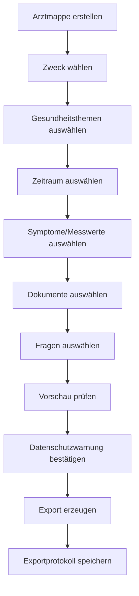

# 090 - Import- und Exportkonzept

Projekt: SASD Health Research Notebook  
Stand: 2026-05-25  
Dokumenttyp: Import-/Exportkonzept  
Status: Entwurf  

## 1. Ziel

Die Anwendung muss Daten nicht nur erfassen, sondern kontrolliert importieren, sichern, exportieren und für Arztgespräche aufbereiten können. Exporte sind besonders sensibel, weil sie Daten aus der geschützten Anwendung herauslösen.

## 2. Importarten

| Import | V1 | Später |
|---|---:|---:|
| PDF manuell | Ja | Ja |
| Bilder/Fotos | Ja | Ja |
| Scans | Ja | Ja |
| Markdown/Text | Ja | Ja |
| CSV für Messwerte | optional | Ja |
| Excel | Nein | optional |
| OCR aus Scan | Nein | Ja |
| Browser/Webclipper | Nein | Ja |
| FHIR | Nein | Ausblick |
| Patientenakte/ePA | Nein | Ausblick |
| Geräteimport | Nein | Ausblick |

## 3. Exportarten

| Export | Zweck | Priorität |
|---|---|---:|
| Markdown-Zusammenfassung | transparente Dokumentation | V1 |
| Arztfragenliste | Terminvorbereitung | V1 |
| Arztmappe als Ordner/ZIP | ausgewählte Dokumente + Zusammenfassung | V1 |
| PDF-Zusammenfassung | druckbare Mappe | V1.1 |
| CSV-Messwerte | Analyse/Weitergabe | V1.2 |
| vollständiges Backup | Datensicherung | V1 |
| verschlüsseltes Backup | sichere Datensicherung | V1/V1.1 |
| FHIR-Export | Interoperabilität | später |

## 4. Arztmappe

Die Arztmappe ist ein zentraler Anwendungsfall.

Inhalt:

- Deckblatt
- Zweck des Exports
- ausgewählte Gesundheitsthemen
- Kurzprofil des Themas
- relevante Symptome/Verlauf
- relevante Messwerte/Laborwerte
- offene Fragen
- besprochene/erledigte Fragen
- ausgewählte Dokumentenliste
- Anhänge
- Hinweis: persönliche Dokumentation, keine Diagnose durch die Software

## 5. Arztmappe-Workflow



## 6. Export-Vorschau

Vor dem Export muss sichtbar sein:

- welche Themen enthalten sind
- welche Dokumente enthalten sind
- welche Fragen enthalten sind
- welche sensiblen Inhalte enthalten sind
- Zielordner
- Format
- Passwortschutz ja/nein

## 7. Datenschutzwarnungen

Beispiele:

```text
Dieser Export enthält Gesundheitsdaten. Bitte speichern oder versenden Sie ihn nur an vertrauenswürdige Empfänger.
```

```text
Der gewählte Zielordner scheint in einem Cloud-Synchronisationsbereich zu liegen. Bitte prüfen Sie, ob dies gewünscht ist.
```

## 8. Backup-Konzept

Ein Backup ist kein normaler Export. Es soll vollständige Wiederherstellung ermöglichen.

Backup-Inhalt:

- Datenbank
- Dokumentenspeicher
- Konfiguration, soweit nötig
- Suchindex optional neu erzeugbar
- Manifest
- Prüfsummen
- Version

Backup-Manifest:

```yaml
application: SASD Health Research Notebook
backup_version: 1
created_at: 2026-05-25T18:00:00
app_version: 0.1.0
contains_database: true
contains_documents: true
document_count: 152
checksum_algorithm: SHA-256
encrypted: true
```

## 9. Restore-Konzept

Restore muss sicherer sein als „Dateien überschreiben“.

Ablauf:

1. Backup auswählen.
2. Manifest prüfen.
3. Version prüfen.
4. Prüfsummen prüfen.
5. Ziel wählen: bestehende Daten ersetzen oder neue Kopie öffnen.
6. Warnung bestätigen.
7. Wiederherstellen.
8. Integrität prüfen.
9. Ergebnis anzeigen.

## 10. Markdown-Export

Markdown ist für V1 sehr gut geeignet, weil es:

- lesbar ist
- versionierbar ist
- leicht in PDF umwandelbar ist
- gut in Git dokumentierbar ist
- keine proprietäre Software erfordert

Beispielstruktur:

```markdown
# Arztmappe - Chronische Sinusitis

## Zweck
Vorbereitung Termin HNO-Arzt am ...

## Kurzüberblick
...

## Verlauf
...

## Offene Fragen
- ...

## Anhänge
- Laborbericht ...
```

## 11. PDF-Export

PDF ist wichtig für Ausdrucke und Weitergabe. Für V1.1 empfohlen.

Optionen:

- Markdown -> PDF über internes Rendering
- HTML -> PDF
- später LaTeX/Pandoc für hochwertige Dokumente

PDF darf nicht zur ersten technischen Blockade werden.

## 12. FHIR-Ausblick

FHIR ist ein Standard zum Austausch elektronischer Gesundheitsinformationen. Für V1 genügt es, das Datenmodell so sauber zu halten, dass spätere Abbildung auf FHIR-Ressourcen möglich wird.

Mögliche Zuordnung:

| Projektobjekt | mögliche FHIR-Ressource später |
|---|---|
| Patient/Profile | Patient |
| Messwert/Laborwert | Observation |
| Dokument | DocumentReference |
| Termin | Appointment |
| Medikamentennotiz | MedicationStatement/MedicationRequest, vorsichtig |
| Arzt/Provider | Practitioner/Organization |
| Condition | Condition, falls echte Diagnose dokumentiert |

## 13. Importvalidierung

Importe müssen robust sein:

- Datei existiert
- Datei lesbar
- Größe plausibel
- Hash berechenbar
- Dateityp erlaubt
- Zielordner verfügbar
- Dublettenprüfung
- Datenbanktransaktion
- Fehlerbehandlung

## 14. Exportprotokoll

Zu protokollieren:

- Exportzeitpunkt
- Exporttyp
- Anzahl Themen
- Anzahl Dokumente
- Zieltyp, nicht zwingend vollständiger Pfad
- Erfolg/Fehler

Nicht protokollieren:

- Diagnosen im Klartext
- genaue Dokumenttitel, wenn sensibel
- Notizinhalte

## 15. Akzeptanzkriterien V1

- Nutzer kann ausgewählte Informationen als Markdown exportieren.
- Nutzer kann eine Arztfragenliste exportieren.
- Nutzer kann eine Arztmappe als Ordner/ZIP erstellen.
- Nutzer sieht vor dem Export eine Vorschau.
- Nutzer wird vor sensiblen Exporten gewarnt.
- Backup kann erstellt werden.
- Backup kann testweise wiederhergestellt werden.


---

## 16. Exportergänzung Baseline 2.1 (2026-09-30)

Zusätzliche auswählbare Exportbereiche:

- Session-Vorbereitung und -Nachbereitung;
- offene Fragen und Folgemaßnahmen;
- ausgewählte HealthActions/Routinen;
- Messwerttabellen;
- Ernährungstagebuch-Ausschnitte;
- Quellen mit genauen Fundstellen;
- ausgewählte Medien/Übungsanleitungen.

Exporte müssen Herkunft und Status erkennbar lassen. Eine eigene Gesprächsnotiz darf nicht so formatiert werden, als sei sie ein offizieller Arztbrief.

Notification-Historie und interne technische Daten werden standardmäßig nicht in fachliche Exporte aufgenommen.
