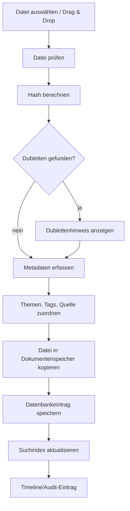

# 070 - Dokumenten- und Quellenkonzept

Projekt: SASD Health Research Notebook  
Stand: 2026-05-25  
Dokumenttyp: Dokumenten- und Quellenkonzept  
Status: Entwurf  

## 1. Ziel

Das SASD Health Research Notebook soll nicht nur Notizen speichern, sondern die Herkunft von Informationen nachvollziehbar machen. Gerade bei Gesundheitsthemen ist es wichtig zu wissen, ob eine Aussage aus einem Arztbrief, einer Laboruntersuchung, einer offiziellen Leitlinie, einer Webseite, einem Forum, einem Buch oder einer eigenen Beobachtung stammt.

## 2. Dokumentenarten

| Dokumenttyp | Beispiele |
|---|---|
| Arztbrief | Befundbericht, Entlassbrief, Facharztbrief |
| Laborbericht | Blutwerte, Urinwerte, Spezialdiagnostik |
| Bild/Foto | Hautbild, Verpackung, Screenshot |
| Scan | Papierdokument, Überweisung, Rezeptkopie |
| Radiologie/Imaging | Befund-PDF, DICOM-Dateien als späterer Ausblick |
| Webseite/PDF | heruntergeladener Artikel, Krankenkasseninfo |
| Studie/Fachartikel | Paper, Abstract, Leitlinie |
| Versicherung/Rechnung | Kosten, Erstattung, Vorgänge |
| persönliche Datei | Ernährungstagebuch, Symptomtagebuch, Tabelle |
| Sonstiges | alles nicht Klassifizierbare |

## 3. Quellenarten

| Quellentyp | Beschreibung |
|---|---|
| Arzt/Praxis/Klinik | medizinischer Ansprechpartner |
| Labor | Laborbericht oder Laborportal |
| offizielle Stelle | Behörde, Fachgesellschaft, Krankenkasse |
| wissenschaftliche Studie | Paper, Review, medizinische Datenbank |
| Buch | Fachbuch oder Ratgeber |
| Webseite | Artikel, Klinikseite, Blog |
| Forum/Community | Erfahrungsaustausch mit niedriger Evidenz |
| Gespräch | Arztgespräch, Telefonat, Beratung |
| eigene Beobachtung | Symptom, Messwert, Ernährung, Kontext |
| Dokument | Quelle ist eine importierte Datei |

## 4. Quellenbewertung

Das System soll nicht automatisch Wahrheit bewerten, aber eine strukturierte Einschätzung erlauben.

| Bewertung | Bedeutung |
|---|---|
| unbekannt | noch nicht bewertet |
| niedrig | unklare Herkunft, Forum, Einzelmeinung |
| mittel | allgemeine Information, nicht primär fachlich |
| hoch | fachlich solide, aber nicht individuell ärztlich bewertet |
| professionell | Arzt, Labor, Klinik, medizinisches Fachpersonal |
| offiziell | Behörde, Fachgesellschaft, Leitlinie, Standard |

## 5. Importprozess für Dokumente



## 6. Dokumentmetadaten

Mindestfelder:

- Titel
- Originaldateiname
- Dokumenttyp
- Dokumentdatum
- Importdatum
- Beschreibung
- zugeordnete Gesundheitsthemen
- Tags
- Quelle
- Dateihash
- Dateigröße
- Speicherort

Optionale Felder:

- Arzt/Praxis/Klinik
- Laborname
- Fachrichtung
- Datenschutzstufe
- Exportfreigabe
- OCR-Status
- externe Referenznummer

## 7. Dateispeicherung

Empfehlung:

```text
data/
  documents/
    2026/
      05/
        <uuid>_<safe_filename>.pdf
```

Originaldateinamen werden in der Datenbank gespeichert, aber interne Dateinamen sollten technisch stabil und möglichst unkritisch sein.

## 8. Dublettenprüfung

Dublettenprüfung per SHA-256-Hash.

Verhalten:

- exakte Dublette erkannt: Hinweis anzeigen
- Nutzer kann trotzdem zuordnen statt erneut speichern
- ähnliche Dateinamen allein gelten nicht als Dublette
- bei unterschiedlichem Hash nicht automatisch zusammenführen

## 9. OCR-Konzept

OCR wird nicht für V1 zwingend empfohlen, aber vorbereitet.

Statuswerte:

- `not_required`
- `pending`
- `done`
- `failed`
- `deferred`

OCR-Text ist genauso sensibel wie das Originaldokument und muss gleich geschützt werden.

## 10. Webquellen erfassen

Für V1 reicht manuelle Quellenanlage:

- Titel
- URL
- Abrufdatum
- Anbieter/Autor
- Kurznotiz
- Zuordnung

Später denkbar:

- Webseite als PDF speichern
- Screenshot speichern
- Webclipper
- Link-Rot-Prüfung
- automatische Metadatenextraktion

## 11. Quellen und Aussagen

Später sollte eine Aussage mit Quelle verbunden werden können.

Beispiel:

```text
Aussage: „Vitamin-D-Mangel kann Müdigkeit begünstigen.“
Quelle: Artikel X, abgerufen am Y
Bewertung: mittel
Kommentar: noch mit Arzt besprechen
```

V1 kann dies über HealthEntry + Source abbilden.

## 12. Dokumente in der Arztmappe

Dokumente sollten nicht automatisch in Exporte wandern. Der Nutzer wählt bewusst aus.

Eigenschaften:

- exportierbar ja/nein
- besonders sensibel ja/nein
- für Arztmappe vorgeschlagen ja/nein
- Kurzbegründung

## 13. Datenschutz bei Dokumenten

- Dokumente dürfen nicht ohne Warnung extern geöffnet oder versendet werden.
- temporäre Vorschau-Dateien müssen kontrolliert werden.
- Exporte dürfen nicht automatisch in Cloud-Speicher landen.
- Dateinamen können sensible Informationen enthalten.
- OCR und Suchindex müssen mitgeschützt werden.

## 14. Quellenqualität in der UI

Die UI sollte Quellenqualität sichtbar machen, aber nicht überbewerten.

Beispiele:

- Badge „offiziell“
- Badge „Arzt/Labor“
- Badge „unbewertet“
- Warnhinweis bei Forum/unklarer Quelle

Keine Formulierung wie „wahr/falsch“ in V1.

## 15. Spätere Literaturverwaltung

Später könnten Konzepte aus Zotero/Mendeley/JabRef übernommen werden:

- bibliografische Metadaten
- DOI
- ISBN
- Autor(en)
- Abstract
- PDF-Anhang
- Zitationsstil
- Literaturverzeichnis

Für V1 genügt eine einfache Quellenverwaltung.

## 16. Akzeptanzkriterien V1

- Nutzer kann ein PDF importieren.
- Nutzer kann Dokument einem Gesundheitsthema zuordnen.
- Nutzer kann Dokument mit Tags versehen.
- Nutzer kann Quelle erfassen.
- Nutzer kann Dokument wiederfinden.
- Nutzer sieht Dublettenhinweis bei gleicher Datei.
- Nutzer kann Dokument in Arztmappe aufnehmen oder ausschließen.
- Importfehler führen nicht zu Datenverlust.


---

## 17. Quellen- und Medienergänzung Baseline 2.1 (2026-09-30)

### 17.1 SourceLocation

Eine Quelle kann mehrere konkrete Fundstellen besitzen.

Beispiele:

- Webseite + URL/Fragment;
- PDF + Seite/Abschnitt;
- Buch + Ausgabe + Seite + Absatz;
- Gespräch + Session + Zeitpunkt/Notiz;
- Dokument + Seite/Abschnitt.

### 17.2 EvidenceNote

Eine EvidenceNote hält getrennt fest:

1. welche Aussage der Nutzer dokumentiert;
2. aus welcher Quelle sie stammt;
3. wo genau sie gefunden wurde;
4. ob Text zitiert oder paraphrasiert wurde;
5. wie der Nutzer die Quelle aktuell einordnet;
6. ob die Aussage mit Arzt/Apotheke/Coach besprochen wurde.

Eine Sterneanzeige kann UI-seitig verwendet werden, benötigt aber eine dokumentierte Bedeutung. Sie ist keine medizinische Validierung.

### 17.3 MediaResource

Bilder, insbesondere bebilderte Übungen, werden als Medienressourcen mit Titel, Beschreibung, Herkunft/Urheberhinweis, Datum, Tags und Beziehungen verwaltet.

Ein MediaResource kann mehreren Objekten zugeordnet werden, ohne die Originaldatei zu duplizieren.
